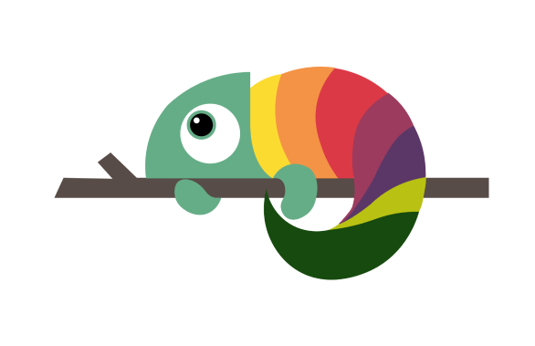

# Chameleon - Your Dynamic Language Exchange Platform

Welcome to **Chameleon**, the ultimate language exchange platform designed to transform the way you connect, communicate, and learn new languages. Named after the adaptable and colorful chameleon, our app helps users seamlessly integrate into diverse linguistic communities, offering personalized and engaging experiences to foster effective language learning.

 

## 🌟 Features

### 1. **User Profiles**
- **Personal Details:** Create a profile with your name, email, and a short description about yourself.
- **Language Proficiency:** Indicate your native language(s), languages you are fluent in, and those you are currently learning.
- **Interests and Status:** Share your interests to find common ground with others and manage your online status.

### 2. **Language Exchange**
- **Fluent and Learning Languages:** Connect with others who speak your target language or who want to learn your native tongue.
- **Rank and Points:** Earn points and rank up based on your proficiency and contributions to the community.

### 3. **Community Engagement**
- **Join Communities:** Explore and join various language-specific communities to participate in group discussions and activities.
- **Community Chats:** Engage in conversations with multiple members within your community.
- **Ice Breakers:** Use pre-defined ice breakers to start conversations smoothly.

### 4. **Direct Interaction**
- **Friendship Network:** Build a network of friends to exchange languages on a more personal level.
- **Private Chats:** Send and receive messages directly with other users to practice language skills.
- **Audio and Video Calls:** Make real-time audio or video calls for immersive language learning experiences.

### 5. **Interactive Messaging**
- **One-on-One Chats:** Engage in individual chat sessions to practice conversational skills.
- **Message History:** Keep track of your conversations and revisit past messages for reference.

## 🛠️ Tech Stack

Chameleon is built using modern web technologies to ensure a seamless and responsive user experience:
- **Frontend:** Next.js for a dynamic and interactive user interface.
- **Backend:** Next.js, Node.js and Express.js for robust and scalable server-side processing.
- **Database:** MongoDB for flexible and efficient data management.
- **Agora:** For real-time audio and video communication.


## Getting Started with Development

To start contributing to Chameleon, you'll need to set up your development environment. Follow these steps to clone the repository and install dependencies:

### Clone the Repository

1. Open your terminal.
2. Navigate to the directory where you want to clone the repository.
3. Run the following command to clone the repository:

```bash
git clone https://github.com/your-organization/chameleon.git
cd chameleon
```
This command makes a local copy of the repository on your machine, allowing you to begin working on the project.

### Install Dependencies
After cloning the project, you'll need to install its dependencies. Ensure you are in the project's root directory and run:


```bash
npm install
```

This command installs all the necessary packages and dependencies required to run the project locally.

### Running The Application
To run the application on your local machine, execute:
```bash
npm run dev
```
This command starts the development server. You can now access the application in your browser at `http://localhost:3000`.

Follow the rest of the development guidelines and project documentation to start contributing to Chameleon. Happy coding!